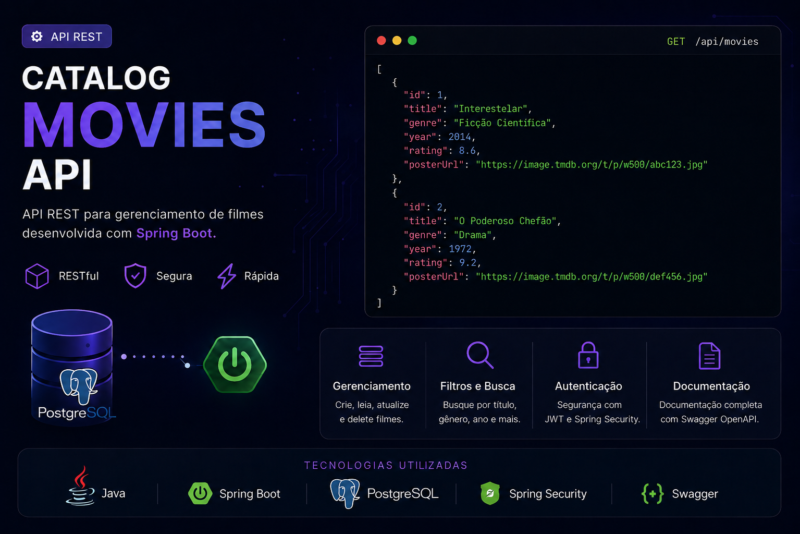
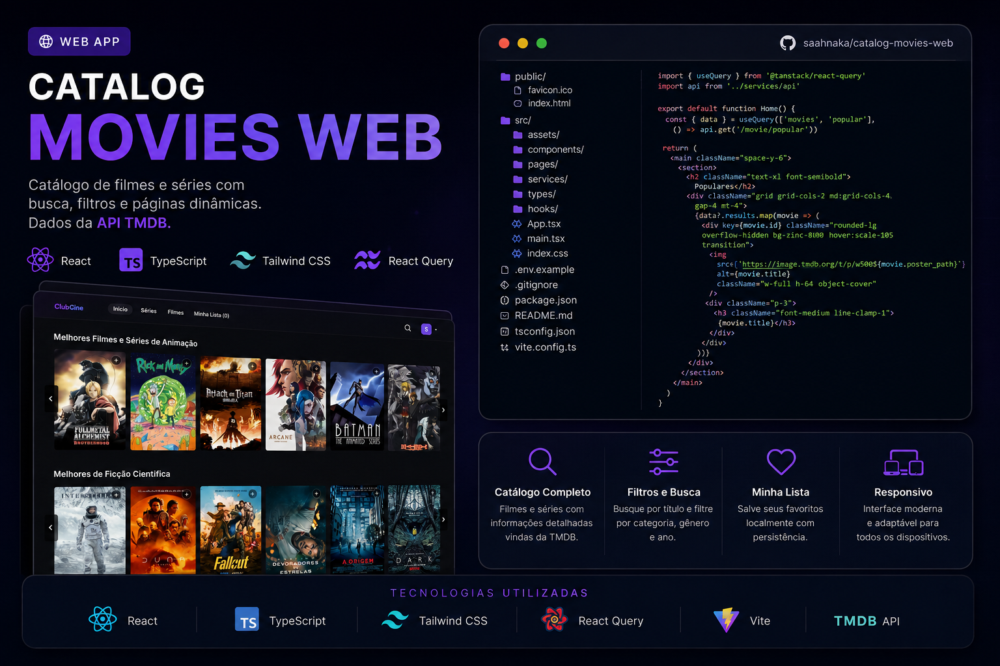
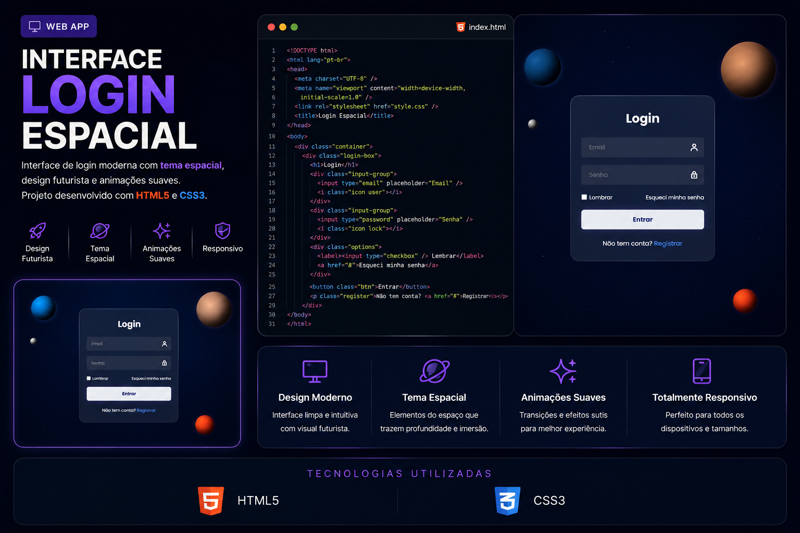
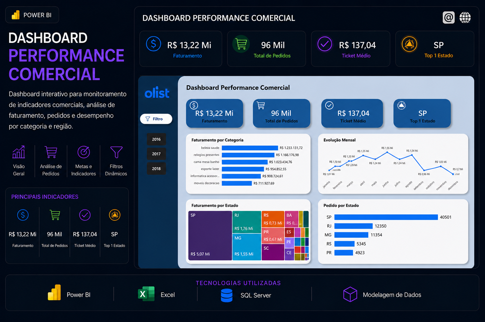
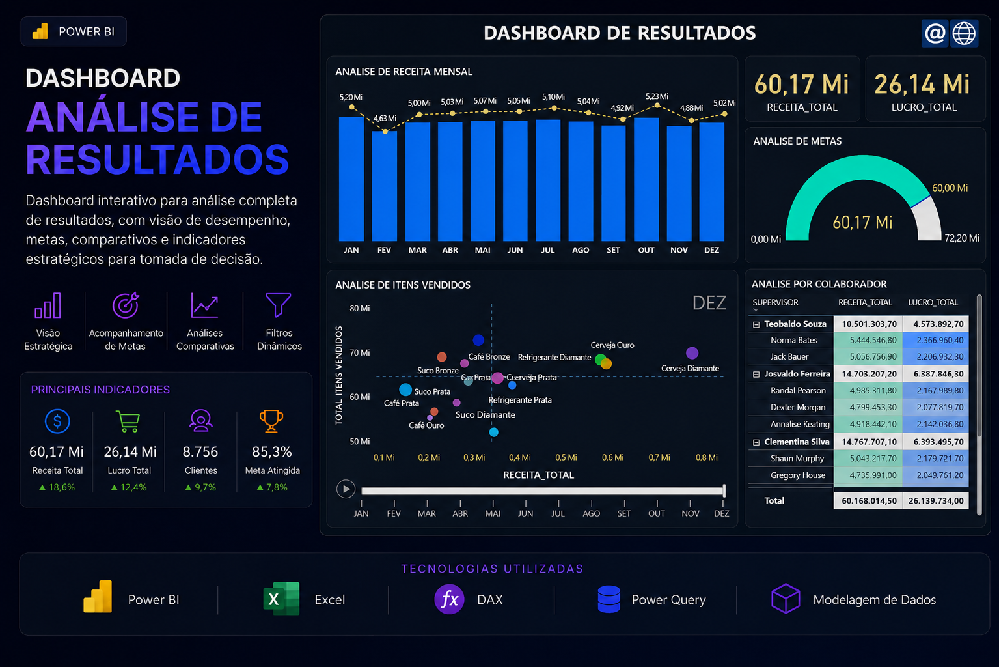
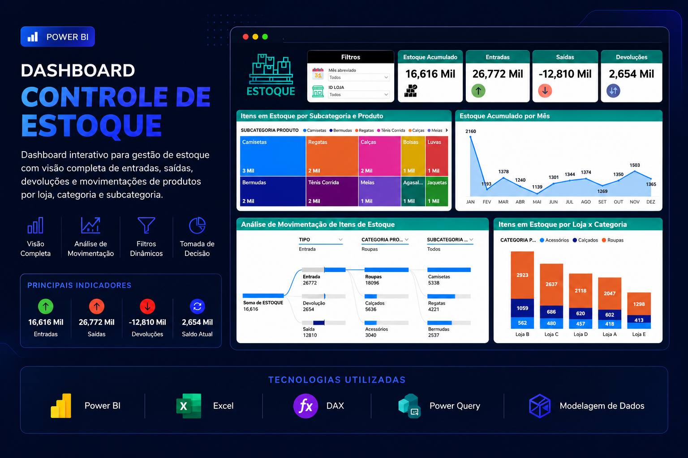

<h1 align="center">Olá! Eu sou Sara Nakagawa 👋</h1>

<h3 align="center">
  💻 Desenvolvedora | 📊 Analista de Dados em formação
</h3>

  🎓 Estudante de Sistemas de Informação

  Transformando dados em decisões e ideias em soluções.

---

## 🚀 Sobre mim

- 🎓 Estudante de **Sistemas de Informação**
- 💻 Interesse em **Desenvolvimento de Software e Desenvolvimento Web**
- 📊 Focada também em **Análise de Dados e Business Intelligence**
- 🌱 Atualmente aprimorando meus conhecimentos em **Java, Python, SQL e Power BI**
- 💡 Gosto de transformar o que aprendo em projetos práticos

---

## 🛠️ Tecnologias e Ferramentas

### 💻 Desenvolvimento

  

### 🗄️ Banco de Dados

  

### 🧰 Ferramentas

  

### 📊 Dados & BI

  
  

---

# 💻 Projetos de Desenvolvimento

## 🎬 Catalog Movies API

  

API REST desenvolvida para gerenciamento de um catálogo de filmes.

**Tecnologias:** Java • Spring Boot • PostgreSQL

  

---

## 🎥 Catalog Movies Web

  

Aplicação Web desenvolvida para consumir a **Catalog Movies API**, permitindo visualizar e interagir com os dados disponibilizados pela API REST.

**Tecnologias:** HTML • CSS • JavaScript

  

---

## 🌐 Portfólio

  

Meu portfólio pessoal desenvolvido para apresentar meus projetos, habilidades e trajetória na área de tecnologia.

**Tecnologias:** HTML • CSS • JavaScript

  

---

## 🚀 Interface Login Espacial

  

Interface de login desenvolvida com design moderno e elementos visuais inspirados no espaço.

**Tecnologias:** HTML5 • CSS3

  

---

# 📊 Projetos de Data Analytics

## 📈 Dashboard de Performance Comercial

  

Dashboard desenvolvido para análise e acompanhamento da performance comercial, facilitando a visualização de indicadores e resultados.

**Tecnologias:** Power BI • Excel

  

---

## 📊 Dashboard de Análise de Resultados

  

Dashboard desenvolvido para análise de resultados e indicadores, transformando dados em informações visuais para auxiliar na tomada de decisão.

**Tecnologias:** Power BI • Excel

  

---

## 📦 Dashboard de Controle de Estoque

  

Dashboard criado para acompanhamento e análise de estoque, permitindo visualizar informações importantes de forma clara e organizada.

**Tecnologias:** Power BI • Excel

  

---

# 📊 GitHub Stats

  
  

---

# 🐍 Minhas Contribuições

  <picture>
    <source
      media="(prefers-color-scheme: dark)"
      srcset="https://raw.githubusercontent.com/Saahnaka/Saahnaka/output/github-snake-dark.svg"
    >
    <source
      media="(prefers-color-scheme: light)"
      srcset="https://raw.githubusercontent.com/Saahnaka/Saahnaka/output/github-snake.svg"
    >
    
  </picture>

---

# 🌎 Contato

  

  

---

<h3 align="center">
  ✨ Sempre aprendendo. Sempre evoluindo. Sempre construindo.
</h3>
